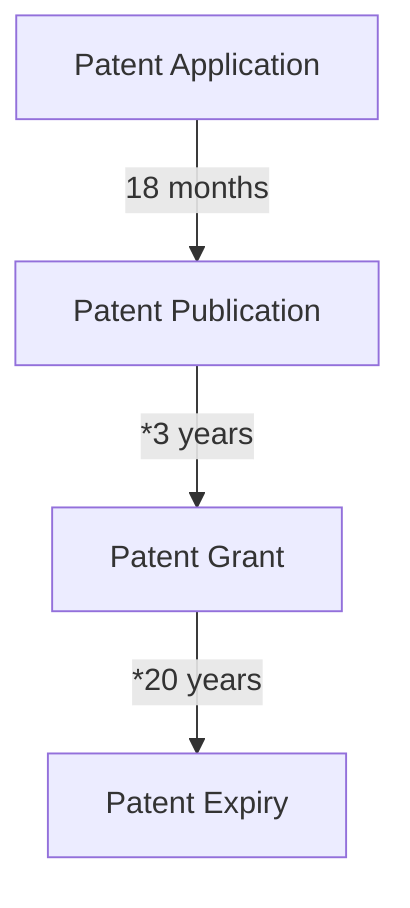

## Introduction

This post is about some of the insights I uncovered when sifting through my patents and inventions through the public databases online. Sharing with a hope that you can use the findings/process/tools to find insights and impact of your's/other's inventions. Let's start with a brief overview of the patent process and a summary/refresher of what different patent numbers, patent citations, patent family, etc mean.

## The patent application to grant process and what the different patent numbers mean

Patent Application --~18 months--> Patent Publication --~3 years--> Patent Grant --~20 years--> Patent Expiry



### Patent Numbers

At each step of the patent process, there is an unique number to identify the document.

The **Patent Application Number** is the number that is assigned to the patent application when it is filed.  
The **Patent Publication Number** is the number that is assigned to the patent application when it is published.  
The **Patent (Grant) Number** is the number that is assigned to the patent after it is granted.

The relationship between these numbers can vary by country. For example, an application publication number and a grant publication number may be the same in some countries (such as with EP applications), since the kind code uniquely distinguishes them. They may also be different (such as with US applications).

In the United States, a publication number includes a four-digit year, followed by a seven-digit sequence code followed by a two-character Kind Code that is assigned by the USPTO. The Kind Code is used to distinguish between different types of publications, such as applications, granted patents, and reissues. For example, a US patent application publication number is 2019/0123456 A1, and a US patent grant publication number is 10,123,456 B2. The application publication number and the grant publication number are different, but the patent number is the same.

Example:

{:class="img-responsive"}

Patent Application Number: US 16/048,144  
Patent Publication Number: US 2020/0033868 A1  
Patent Grant Number: US 10,845,815 B2 ==> 10,845,815 is the patent number

The patent publication numbers follow this format: country code, a number, and a kind code

**Kind code** : version numbers for published versions of the patent application.  
Every country has their own set of kind codes, but typically an A code (such as A1) represents a patent application, and a B code (such as B2) represents a granted patent

## Patent citations, Patent Examiner's citations

Patent Citations: Citations in the patent document itself

Patent Examiner's Citations: Citations by the patent examiner

## Patent Document, Patent Family

**Patent Document**: A patent application or a granted patent

**Patent Family**: A set of patents and patent applications that are related to each other. I.e. they protect the same or similar invention by the same inventors, typically filed in different countries.

One invention can be patented in multiple countries. For example, my patent US 10,845,815 B2 is also patented in China and Germany. These patents are related to each other and form a patent family.

One patent can only have up to 20 claims. Some of the claims can be granted and some can be rejected.

## Patent Classification Codes

Patent Classification Codes are used to classify patents based on the technology they cover. The patent classification codes are used to search for patents in a specific technology area. For example, one of the patent classification code for my patent US 10,845,815 B2 is G06N 3/08 for "learning methods" as shown below:
{:class="img-responsive"}

## Tools, Resources and Databases

### Google Scholar Profile's Patent information is incomplete

Google Scholar profile automatically includes _some_ patent documents and an _incomplete_ patent citation count.

### Google Patents

Google patents is a great resource if you know the patent/publication numbers to lookup. The URL format is straightforward for example: `https://patents.google.com/patent/US10678252B2` where the last part is the patent or publication number.
It has a nice side panel that shows the patent numbers and citations along with the Classification codes, Claims, Description and Drawings as shown below:
{:class="img-responsive"}

But, searching for patents on Google Patents didn't yield complete results in my experience. For example, I couldn't find my patent US 10,845,815 B2 on Google Patents search results by inventor name. I had to use the patent number directly to find it. The Google patent search results by intentor name returned an incomplete list of granted patents and patent applications.

Use lens.org for a more complete list of patents, metrics, analysis and insights.

## Insights from my patents and inventions

### Discovery: My patents were cited by world's leading organizations

I discovered that my inventions have:

### 1. High-impact citations

Google Deepmind's ["Multi-agent reinforcement learning with matchmaking policies" patent which was granted on 2023-04-11 cites 3 patents in total (including patent examiner's citations) and one of which is my patent application US20200033868A1](https://patents.google.com/patent/US11627165B2#patentCitations) which was [granted in 2020-11-24](https://patents.google.com/patent/US10845815B2). The fact that the invention by David Silver (AlphaGo, AlphaZero lead), Oriol Vinyals (AlphaStar lead) and Max Jaderberg cites my work, motivates me as my work is indeed impactful.

### 2. 470+ Patent citations

There are more than 15 organizations that cite my patent. Some of them are: Tesla, IBM, Sony, Qualcomm,

```

```
