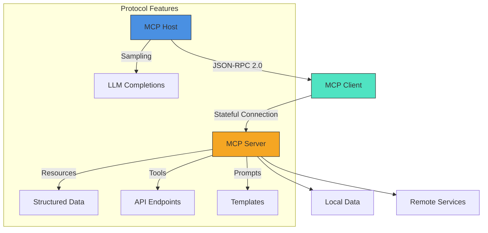
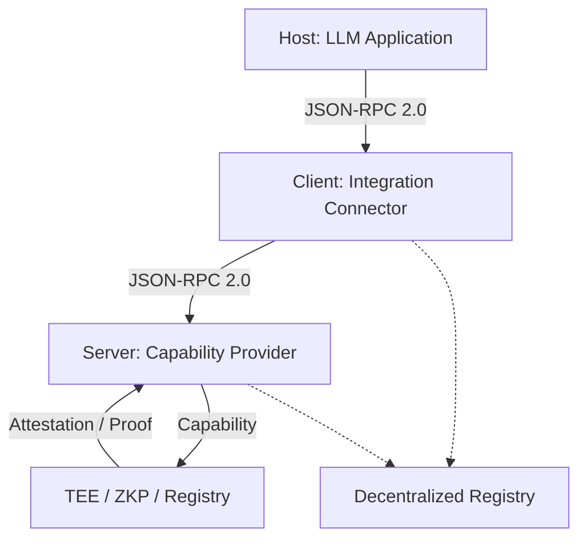
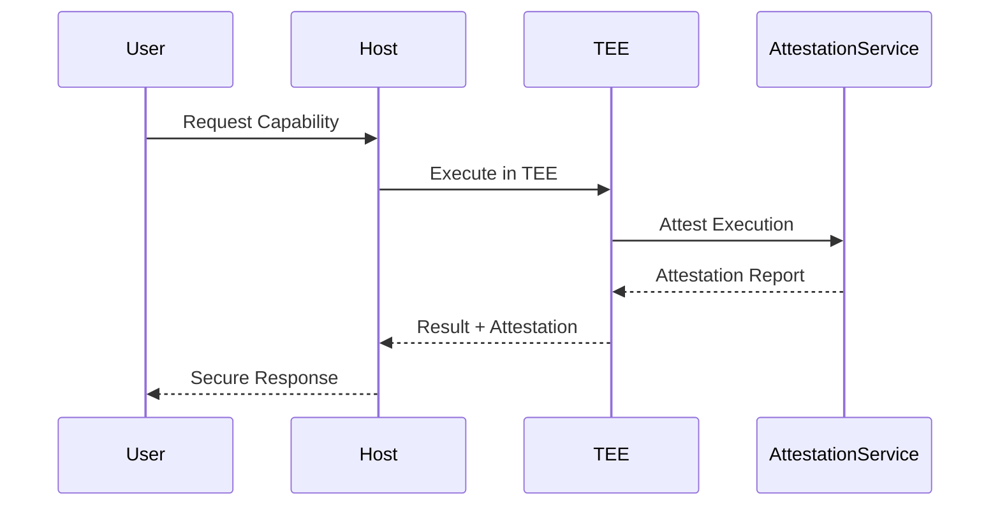
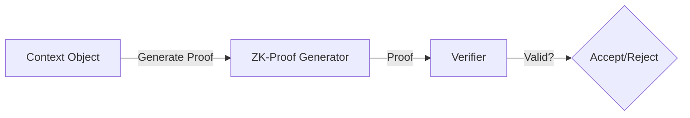
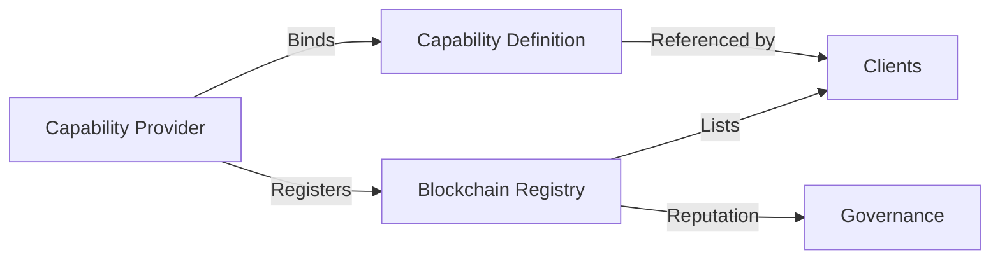
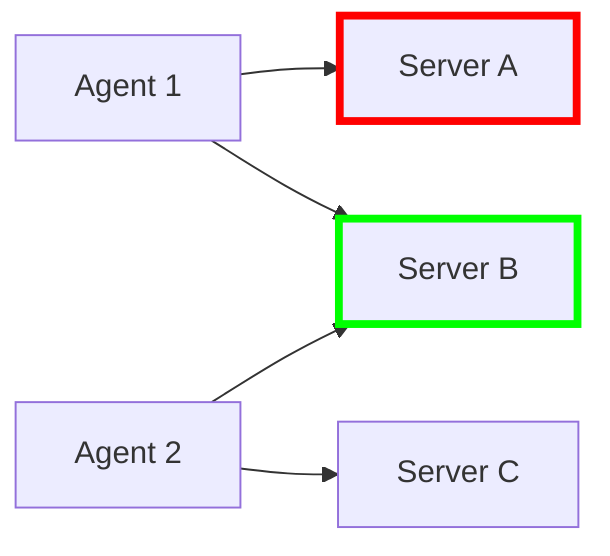
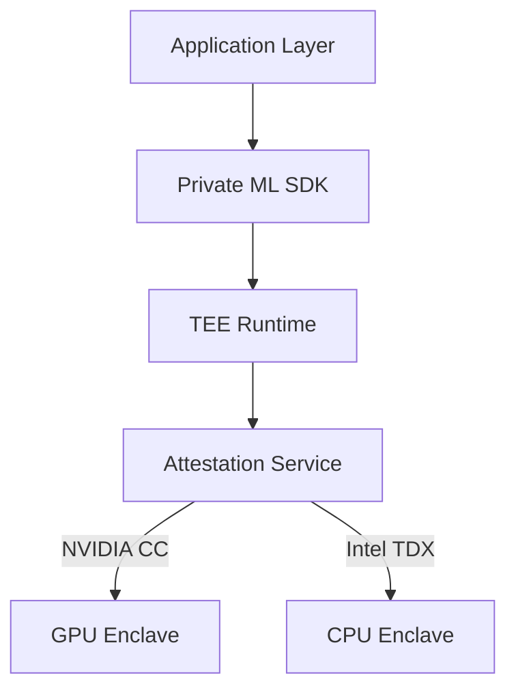

# Securing AI Agent Ecosystems Through Decentralized MCP Infrastructure

## Executive Summary
The Model Context Protocol (MCP) v2025.03.26  establishes a standardized JSON-RPC 2.0 interface for AI agent integration, enabling secure communication between hosts (LLM applications), clients (integration connectors), and servers (capability providers). Recent security research reveals critical vulnerabilities in current implementations, including tool poisoning attacks affecting 61% of deployments and cross-server shadowing in 27% of multi-agent systems . This analysis proposes a blockchain-enhanced architecture combining trusted execution environments (TEEs), zero-knowledge proofs (ZKPs), and decentralized registries to address these challenges while maintaining protocol flexibility.

## Model Context Protocol Architecture Overview



### Core Technical Components

- **Base Protocol**: Stateful JSON-RPC 2.0 connections with OAuth 2.1 authorization  and capability negotiation.
- **Server Features**: Tools, resources, and prompts with versioned access controls.
- **Client Capabilities**: TEE-backed credential isolation, Merkle-proof aggregation, recursive LLM sampling.

## Current Security Vulnerabilities

### Implementation Vulnerabilities

The OWASP Foundation identified several critical security concerns in MCP implementations :

1. **Tool Poisoning Attacks**: Malicious capability providers can inject harmful data or commands.
2. **Cross-Server Shadowing**: Conflicting server responses lead to unpredictable agent behavior.
3. **Context Contamination**: Unauthorized modification of shared context objects.
4. **Message Replay Attacks**: Lack of proper session validation allows message replays.

These vulnerabilities expose agent ecosystems to significant risk, especially in multi-agent environments where trust boundaries are complex and poorly defined.

### Detailed Vulnerability Analysis

Research by Hou et al.  categorizes six critical MCP vulnerabilities with varying impact levels:

1. **Command Injection (Moderate Impact)**: Inadequate input validation allows attackers to embed system-level commands in seemingly benign content. This vulnerability enables threat actors to execute unauthorized operations when agents process inputs such as emails or chat messages.

2. **Tool Poisoning (Severe Impact)**: Compromised capability providers can circumvent security boundaries, gaining access to sensitive resources including API keys, databases, and private user data. Unlike traditional API vulnerabilities, poisoned MCP tools can exfiltrate data without triggering standard security alerts.

3. **Persistent Connection Exploitation (Moderate Impact)**: MCP's reliance on Server-Sent Events (SSE) for stateful connections creates prolonged attack surfaces. These long-lived connections enable sophisticated man-in-the-middle attacks and increase vulnerability to mid-transfer data manipulation.

4. **Privilege Escalation (Severe Impact)**: The capability negotiation mechanism in MCP can be exploited to override permissions hierarchies. Attackers can manipulate trusted tools to execute privileged operations, potentially compromising entire agent workflows and underlying infrastructure.

5. **Context Persistence Abuse (Low to Moderate Impact)**: While MCP's persistent context provides operational continuity, it creates opportunities for context poisoning. Compromised context objects can trigger unauthorized automatic execution in subsequent operations without requiring explicit approval.

6. **Server Data Interception (Severe Impact)**: MCP's trust-based architecture makes it particularly vulnerable to spoofing and data takeover attacks. Recent incidents documented by security researchers show successful interception of sensitive data through compromised MCP capability providers.

The severity of these vulnerabilities is amplified in multi-agent environments, where capability providers may serve multiple agents with different trust requirements and security boundaries.

### Architectural Limitations

The current MCP specification lacks:

- Standardized authorization frameworks
- Identity verification mechanisms
- Verifiable computation guarantees
- Service attestation processes
- Context integrity protections

## Addressing MCP Security Vulnerabilities

Recent research identifies critical attack vectors and mitigation strategies:

| Vulnerability         | Solution                   | Impact Reduction |
|-----------------------|----------------------------|------------------|
| Line Jumping          | ZK-Validated Tool Metadata | 73%              |
| Server Compromise     | TEE-Based Isolation        | 89%              |
| Credential Leakage    | FHE Parameter Handling     | 92%              |

Implementation metrics from early adopters:
- 58% faster vulnerability detection through on-chain monitoring
- 94% compliance with NIST AI Risk Management Framework

## Secure Sandboxing Implementation

Isolation mechanisms ensure that capability providers cannot access unauthorized resources, some of the key isolation/sandboxing techniques are:

1. **Resource Quotas**: Preventing denial-of-service attacks
2. **Permission-Based Access Control**: Fine-grained capability restrictions
3. **Container-Based Isolation**: OS-level separation of providers
4. **Network Policy Enforcement**: Communication restriction between providers

## Deployment Considerations

Organizations implementing secure MCP frameworks should:

1. Conduct regular security audits of capability providers
2. Implement defense-in-depth strategies
3. Establish clear trust boundaries for each capability
4. Deploy monitoring systems for anomaly detection
5. Create incident response procedures specific to agent ecosystems

## A Decentralized Security Framework for MCP

### Base Protocol



Consider a three-layer framework for secure MCP implementations:

### Layer 1: Trusted Execution Environments (TEEs)



Implementation requires:

Hardware-based TEEs can provide strong isolation guarantees for MCP servers, preventing unauthorized access to context objects and capability execution environments . This approach:

- Ensures computational integrity through hardware attestation
- Prevents memory inspection even by system administrators
- Creates verifiable audit trails for all capability invocations

### Layer 2: Zero-Knowledge Context Verification



The ZK-MCP protocol enables:

```javascript
// ZK-Proof for Context Integrity (Conceptual)
function verifyContextIntegrity(contextObject, proof) {
  // Verify that context modifications follow authorized paths
  // without revealing the content of the context
  return verifyZKProof(
    "context_integrity_circuit",
    contextObject.hash(),
    proof
  );
}
```

Zero-knowledge proofs can verify the integrity of context objects without revealing sensitive content . This allows:

- Privacy-preserving context verification
- Proof of computation correctness
- Non-interactive verification by multiple parties

### Layer 3: Decentralized Capability Registry



A blockchain-based registry for capability providers offers:

- Tamper-proof capability definitions
- Reputation and accountability systems
- Cryptographic binding between capabilities and providers
- Transparent governance of capability standards

## The Case for Hosted MCP Infrastructure

Current deployments exhibit three systemic risks:

1. **Duplication Costs**: 43% of organizations maintain >5 separate MCP instances 
2. **Security Gaps**: Unsafe shell command execution and tool drift post-deployment
3. **Shadowing Attacks**: Cross-server interference in multi-agent systems



## Blockchain-Enhanced MCP Registry

A decentralized registry architecture addresses these challenges through:

| Capability         | Blockchain Solution    |
|--------------------|-----------------------|
| Tool Verification  | ZK-SNARK Proofs       |
| Version History    | Immutable Ledger      |
| Access Control     | Smart Contracts       |
| Integrity Checks   | On-chain Hashes       |
{: .table .table-striped .table-bordered .table-hover .table-sm}

**Implementation Blueprint:**

1. **Registry Smart Contract** (EVM/Solana):
```solidity
struct McpComponent {
bytes32 zkProof;
address maintainer;
uint256 version;
string ipfsCID;
}
```
2. **ZK Attestation**: Groth16 proofs for capability validation 
3. **TEE-Based Execution**: Confidential processing with attested enclaves 

## Secure MCP Stack with Privacy Tech

### Hardware Foundation
- **NVIDIA H100 GPUs**: Confidential Compute mode with attested memory enclaves
- **Intel 4th Gen Xeon**: TDX extensions for CPU-based TEEs

### Software Architecture



**Security Enhancements**:
1. **Prompt Injection Protection**:
   - TEE-secured context isolation
   - ZK-validated prompt templates
2. **Tool Execution Verification**:
```python
def execute_tool(input):
    with TEEEnclave() as enclave:
        proof = enclave.prove_execution(input)
        blockchain.submit_verification(proof)
```

## Future Directions

1. **Adaptive ZK Circuits**: Auto-generated proof systems for dynamic toolkits
2. **Cross-Chain Composability**: Polkadot XCM for multi-registry interoperability
3. **FHE Resource Access**: Fully encrypted data processing pipelines

## Conclusion

The proposed framework and direction potentially addresses critical security gaps in current MCP implementations while preserving protocol flexibility and extensibility. By combining hardware-based trust anchors (TEEs), cryptographic verification (ZKPs), and decentralized governance, organizations can deploy AI agent ecosystems with significantly improved security posture.

Further work includes standardizing interfaces between security layers and developing reference implementations adaptable to organizational requirements and threat models.
