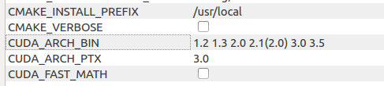

##nvcc fatal   : Unsupported gpu architecture 'compute_11'

If you get the above error while compiling OpenCV with CUDA,

Then as it says, it means the GPU doesn't support `compute_11` or `compute_xx`
whichever version it says. 

To overcome or to avoid this error, follow one of the following which ever suits your case:
* If you are currently in the process of building OpenCV from source (of course with CUDA support) then, you can re-generate the make file using CMAKE and make sugit re the `CUDA_ARCH_BIN` does not contain the version number that is not supported. For example, if the error is `nvcc fatal   : Unsupported gpu architecture 'compute_11'` then make sure the `CUDA_ARCH_BIN` does not include `1.1`. Eg.:

* You can also open the `openCVConfig.cmake` file and
delete the line which read like `-gencode;arch=compute_11,code=sm_11;`
in the call to `set(OpenCV_COMPUTE_CAPABILITIES`
