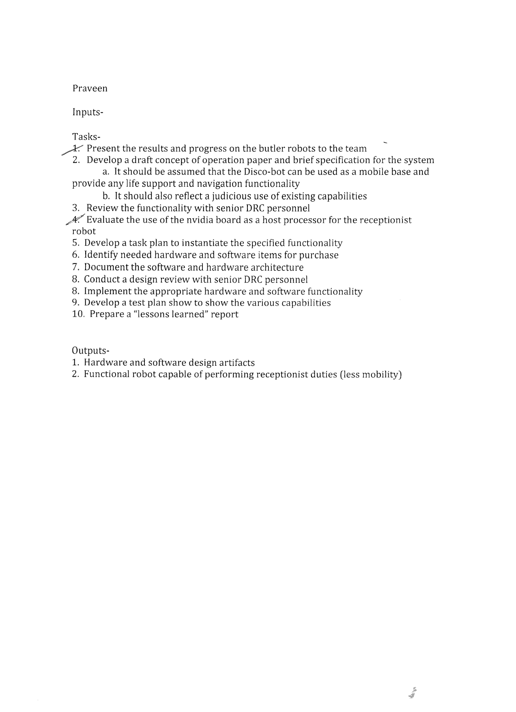
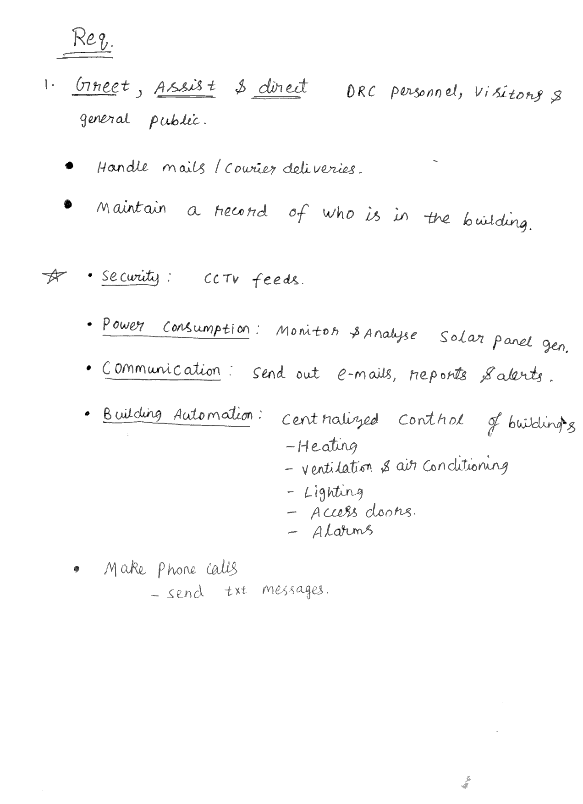

2015-05-21

Thu, 21 May 2015 10:21:12

#Quick & brief Updates
* ####Joined Discovery Robotics, Pittsburgh, PA on Monday, 18th May, 2015.
* Met with Larry Williams, the vice president,Finished the paper works along with Jaghvi Mehta and Sonali Deshpande. 
* #####Got an Nvidia Jetson TK1 development board on day one! Yeah. the board with the 192 CUDA cores (Keppler GPU).
* Requested for a monitor and eventually received it on wednesday, 20th May 2015. (More on this later)
* Got a sheet of paper from Larry:

Thu, 21 May 2015 14:55:24
===========================
Spent a lot of time to set up a nice way to be able to write in markdown on sublime text, ctrl+b to build it to html, push it to my newly created bitbucket private repository at <http://praveenofpersia.bitbucket.org >. Although the repository is private the pages in <http://praveenofpersia.bitbucket.org/workDiary> and <http://praveenofpersia.bitbucket.org/wiki> are all publicly readable.
I created the workDiary and wiki directory for obvious reasons. From the start of work on 18th may, I was trying to figure out a useful way to document all my works, researches, and stuffs so that I can search and look back at whay I did and refresh it much quickly.
Thu, 21 May 2015 14:58:57
Used a cool one lineer at the terminal to replace a space character in the filenames of all the files in the current directory. it goes like this **for f in \*\ \*; do mv "$f" "${f// /_}"; done **
The __\*\ \*__ is for  searching for spaces in all the file names.
The __${f// /_}__ is a regular expression to replace spaces with underscores.

Thu, 21 May 2015 15:01:29
I have been trying to insert images into the markdown for long today. The relative paths were for some reason not working well. And I dont want to use the absolute URL for the images. 
I have setup the bitbucket repository on : ~/Copy/dev/bitbucket/praveenofpersia.bitbucket.org/

Thu, 21 May 2015 15:39:192
-----------------------

The journalling/documenting setup using sublimeText-markdown-bitbucket is almost done. The only thing I am not happy with is the md to html conversion. The pages are not so pretty. They are narrow and run long. They don't seem to use the page width much.

Thu, 21 May 2015 15:50:49
-----------
Didn't know about array fire before. 
`ArrayFire is a high performance software library for parallel computing with an easy-to-use API. Its array based function set makes parallel programming simple.

ArrayFire's multiple backends (CUDA, OpenCL and native CPU) make it platform independent and highly portable. `

Seems like a good thing to know.

Thu, 21 May 2015 16:16:12
-------------------

There is Array Fire, there is cuDNN, Caffee, there is OpenCV4Tegra ...

Thinking about what will be the right thing to start with. 

Thu, 21 May 2015 17:11:33
-------------------

The OpenCV4Tegra binaries that come with the Nvidia Jetpack does not have the nonfree module. So, no SIFT etc.

Tue, 16 Jun 2015 17:21:45
==============================
A draft of features and functionalities for the Receptionist Robot that I made initially:

