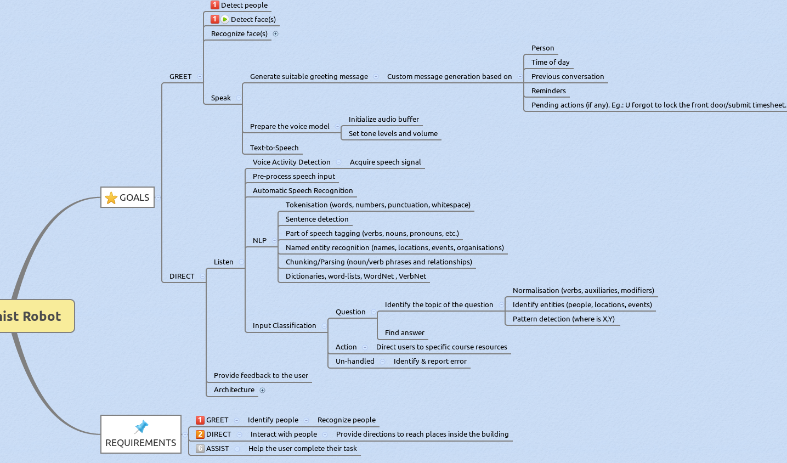

2015-06-12

3PM meeting.
Presented the concept of operation of the **Receptionist Robot** to the DRC (Discovery Robotics Corporation) team. 
Members present:
1. Kent 
2. Larry Williams
3. Dave Moore
4. Vivek Rajendran
5. Naman Kumar
6. Hardik Shah
7. Laura Peterson
8. Sonali Deshpande
9. John S
10.Connor
11.Jaghvi
12.Brownies

 Presented using the xmind presentation mode! using my laptop (no projector in the 1st flr conf. room)
CoOp(concept of Operation)
 