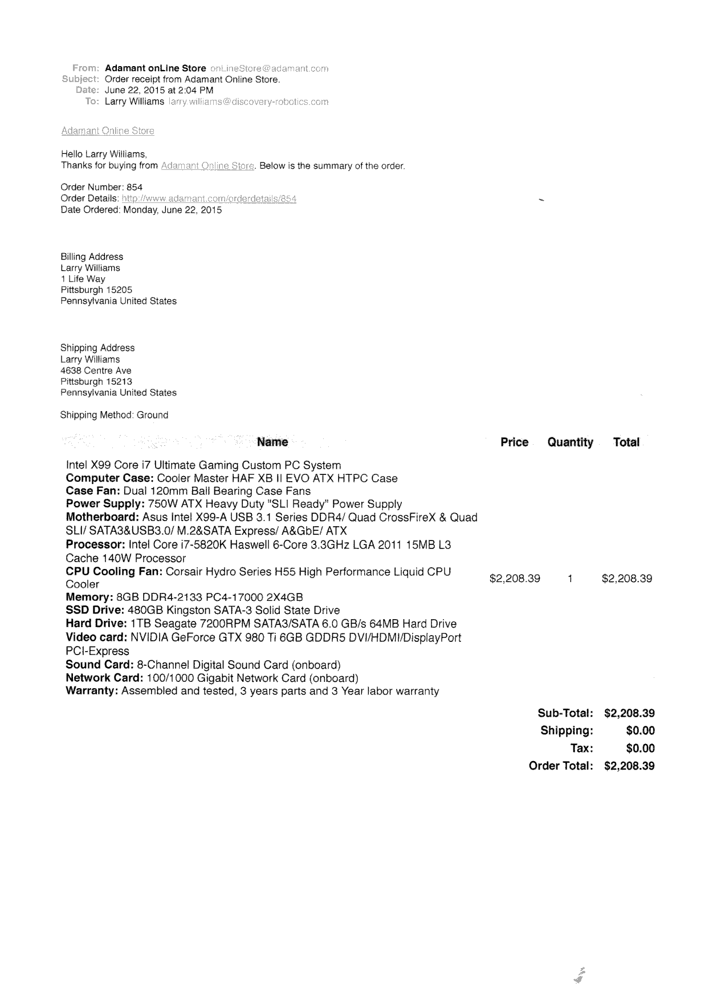

2015-06-22

Mon, 22 Jun 2015 11:16:55
============================

Spoke with Larry about buying/building a computer for the Receptionist robot. Key insights: He says "So, we are looking at a $3k machine." and I go "No. The costliest parts are the GPU and the CPU and they are in the
 500-600 range". I think I should go with the best configuration that will get the work done quicker.
 Mon, 22 Jun 2015 14:18:23
 ============================
 Placed an order for a Desktop PC with good specs!Below is the details about the hardware/order:
 


 Mon, 22 Jun 2015 16:23:35
 ===============================
Migrating the OpenCV face Recognition example from the book code from 2.4 to OpenCV 3.0
Using  `createLBPHFaceRecognizer()` ,
```cpp 
// Now updating the model is as easy as calling:
model->update(newImages,newLabels);
// This will preserve the old model data and extend the existing model
// with the new features extracted from newImages!
```

```
Calling update on an Eigenfaces model (see createEigenFaceRecognizer), which doesn't support updating, will throw an error similar to:
OpenCV Error: The function/feature is not implemented (This FaceRecognizer (FaceRecognizer.Eigenfaces) does not support updating, you have to use FaceRecognizer::train to update it.) in update, file /home/philipp/git/opencv/modules/contrib/src/facerec.cpp, line 305
terminate called after throwing an instance of 'cv::Exception'
```