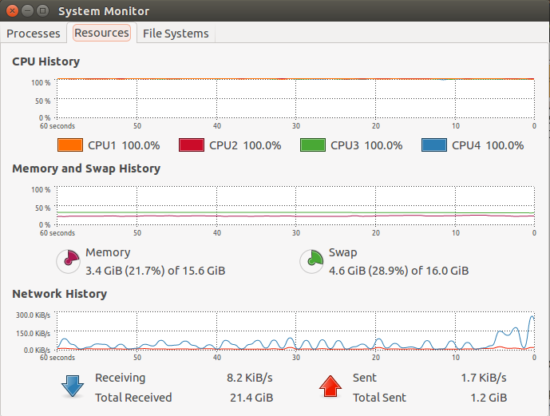

2015-06-23

Tue, 23 Jun 2015 10:08:15
=============================
Compiling OpenCV 2.4.11 so that I can do `sudo make install` in the OpenCV2.4.11 build directory or in OpenCV3.0 build directory depending on which version I need for the programs. The advantage is that I don't have to configure the `pkg-config --libs --cflags`

I did a `make -j4` in OpenCV 2.4.11 build directory and this is the CPU usage as shown on the system monitor:

Tue, 23 Jun 2015 11:54:29
=========================
Got the ch8 facerec code up and running (un-did all the changes to port it to OpenCV3. Now it runs with OpenCV2.4.11)
